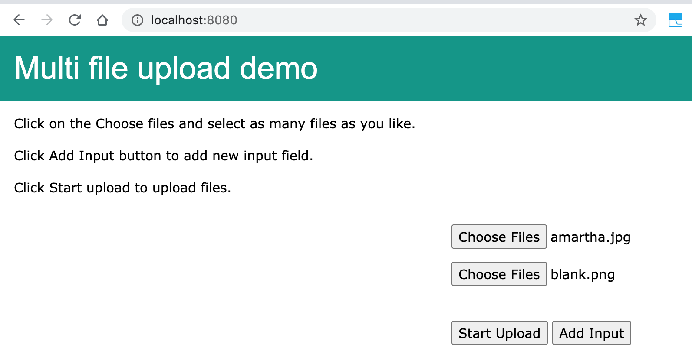
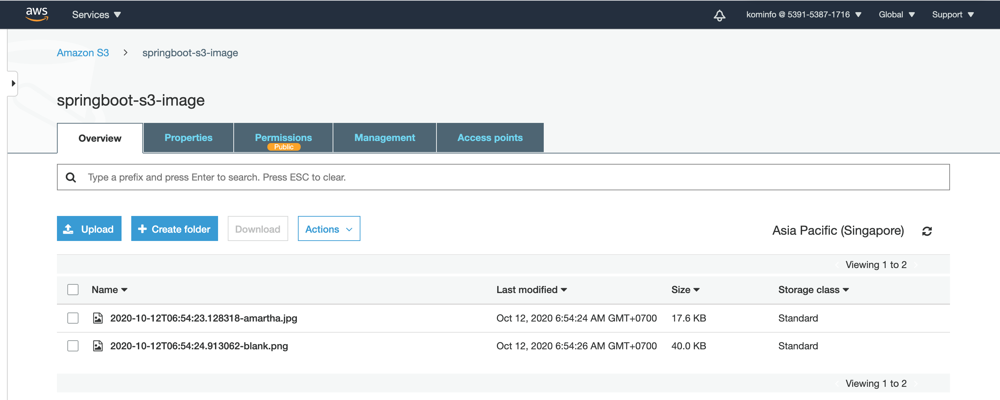

# SpringBoot-S3-Multi-File-Upload
### Things todo list:
1. Clone this repository: `git clone https://github.com/hendisantika/SpringBoot-S3-Multi-File-Upload.git`
2. Go inside the folder: `cd SpringBoot-S3-Multi-File-Upload`
3. Set your AWS Credentials Key & Secret in `application.properties`
4. Run application: `mvn clean spring-boot:run`
5. Open your favorite browser: http://localhost:8080/

###

Home Page to Upload Image

AWS S3 Image Folder

