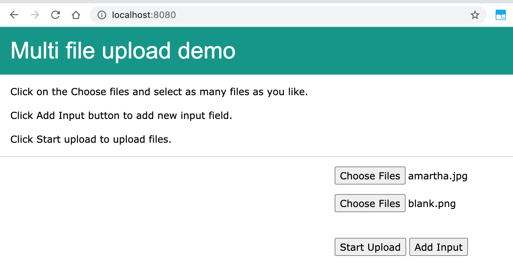
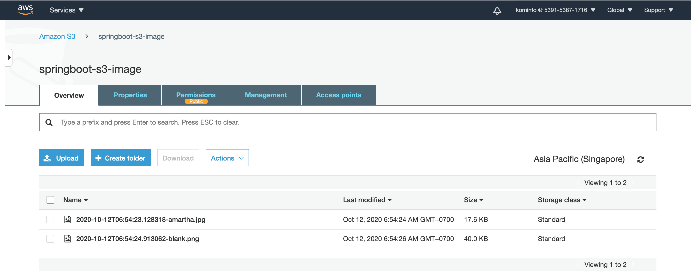

# SpringBoot-S3-Multi-File-Upload

A Spring Boot demo application for uploading multiple files to an AWS S3 bucket (with a local-disk upload mode as an alternative).

## Tech Stack

- Java 25
- Spring Boot 4.1.0
- AWS SDK for Java v2 (S3)
- Lombok
- Maven

## Prerequisites

- JDK 25+
- An AWS account with an S3 bucket (only required for the `s3` upload mode)

## Getting Started

1. Clone this repository:
   ```shell
   git clone https://github.com/hendisantika/SpringBoot-S3-Multi-File-Upload.git
   ```
2. Go inside the folder:
   ```shell
   cd SpringBoot-S3-Multi-File-Upload
   ```
3. Configure `src/main/resources/application.properties`:
   - Set your AWS credentials (`s3.accessKey`, `s3.secretKey`), `s3.endpointUrl`, `s3.bucketName`, and `s3.region`.
   - Choose the upload mode via `uploadServiceType`: `s3` (default) to upload to AWS S3, or `local` to store files under `fileUploader.path`.
4. Run the application:
   ```shell
   ./mvnw spring-boot:run
   ```
5. Open your favorite browser: http://localhost:8080/

## Running Tests

```shell
./mvnw test
```

## Screenshots

Home Page to Upload Image



AWS S3 Image Folder


